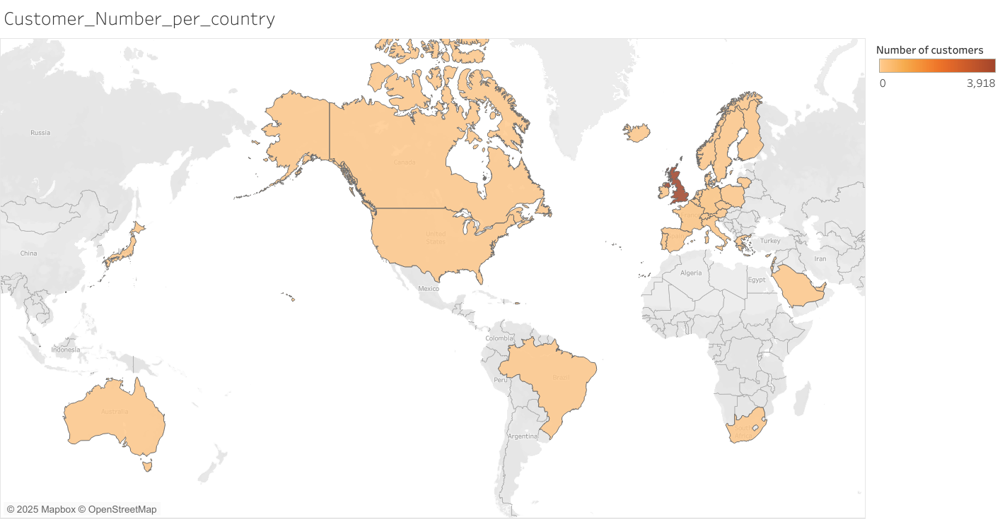
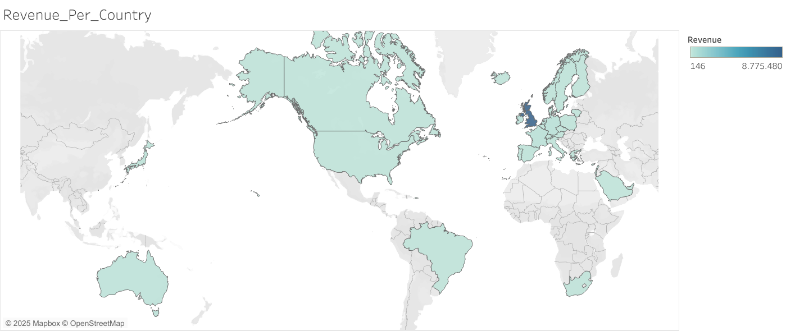

# E-Commerce Data Analysis

**Independent Data Analytics Project**  
**Michalis Loizos, June 2025**

  
  


This independent project analyzes 541,909 sales transactions from an e-commerce dataset to uncover business insights using **BigQuery SQL**, **R** (tidyverse, ggplot2, lubridate), and **Tableau**.  

---

## Project Overview

- **Dataset**: 541,909 e-commerce sales transactions (not included due to size).
- **Tools Used**:  
  - BigQuery SQL (Data Querying)  
  - R (Data Wrangling, Visualization with tidyverse, ggplot2, and lubridate)  
  - Tableau (Interactive Dashboards)  
- **Key Insights**:  
  - **Revenue Trends**: Identified peak sales times (monthly and hourly).  
  - **Customer Segmentation**: Most profitable customer segments classified.  
  - **Top Products**: Analysis of the best-performing products.  
- **Recommendations**:  
  - Focus marketing efforts on the most profitable customer segments.  
  - Optimize inventory for top-performing products.  
  - Implement time-based promotions to boost sales during peak hours.

---

## Sample Visualizations

Below are a few insights visualized during the analysis:

### Monthly Revenue Trends


### Hourly Revenue Trends


### Customer Distribution by Country


### Revenue by Country


More details are available in the [full report](E_Commerce_Report.pdf).

---

## How to Run the Project

1. Clone this repository:
   ```bash
   git clone https://github.com/michloiz/E_Commerce_Data.git
   ```
2. Open the R Markdown report (`ECommerce_Data.Rmd`) in RStudio.
3. Knit the report to PDF/HTML to view the results.

> ⚠️ *Note*: The dataset is not included but can be accessed [here](https://www.kaggle.com/datasets/carrie1/ecommerce-data).

---

## Repository Structure

```
E_Commerce_Data/
│
├── Figures/                                 # Folder with figures generated by the analysis
│   ├── Customer_Number_per_country.png      # Customer Distribution by Country
│   ├── Hourly_Revenue_Trends.png            # Hourly Revenue Trends
│   ├── Monthly_Revenue_Trends.png           # Monthly Revenue Trends
│   └── Revenue_Per_Country.png              # Revenue by Country
├── ECommerce_Data.Rmd                       # R Markdown source
├── ECommerce_Data.pdf                       # Full report (PDF)
├── README.md                                # Project documentation
└── ... (other files)
```

---

## Contact

Feel free to reach out for any inquiries:

- **LinkedIn**: [Michalis Loizos](https://www.linkedin.com/in/michalis-loizos/)  
- **Email**: [mihalis.loizos@gmail.com](mailto:mihalis.loizos@gmail.com)

---

## License

This project is licensed under the [MIT License](LICENSE).
